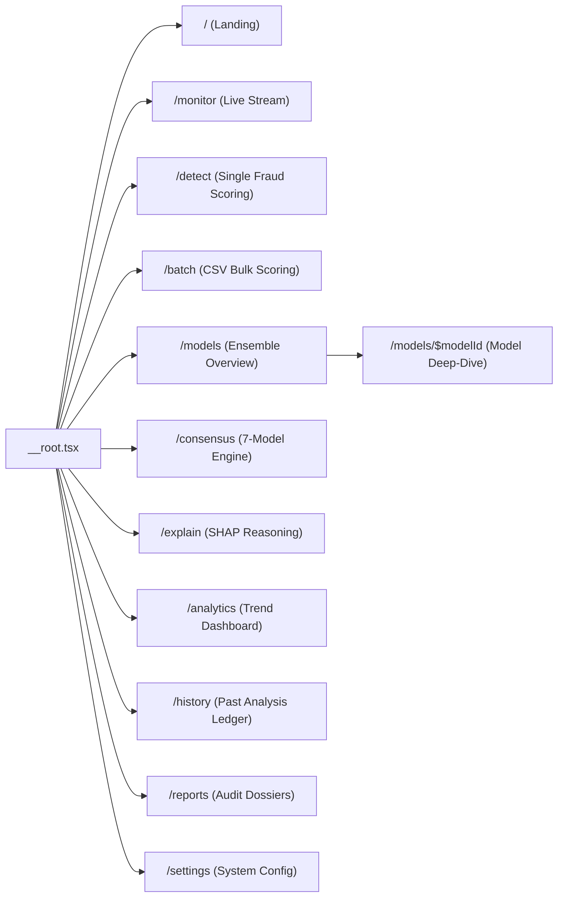
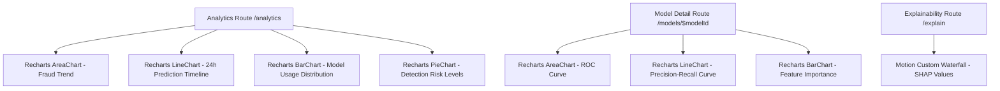
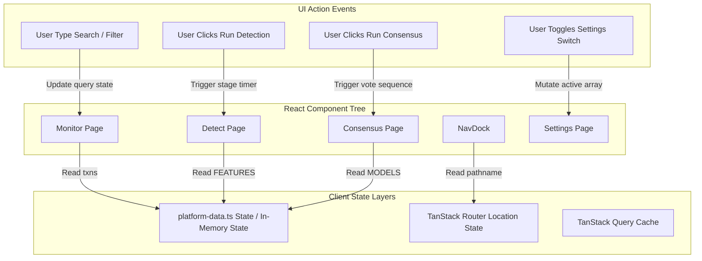
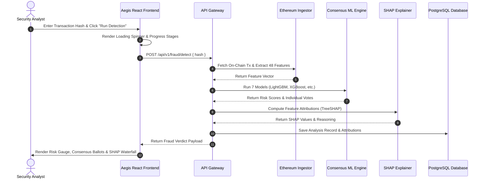
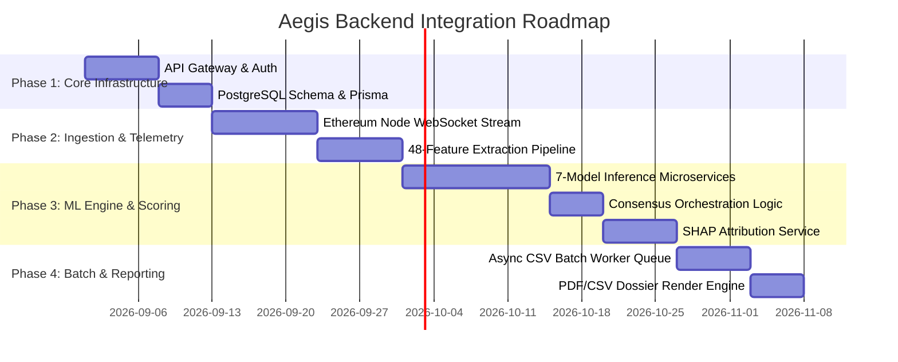

# Aegis — AI Ethereum Fraud Detection Command Center
## Frontend Architecture Document & Backend Integration Specification (SDD)

---

> **Document Type:** Software Design Document (SDD) / Frontend & System Architecture Specification  
> **Target Project:** `eth-vigil` (Aegis Command Center)  
> **Author:** Senior Software Architect, Lead Technical Writer & Full-Stack Engineer  
> **Status:** Final Draft / Ready for Backend Integration & Thesis Inclusion  
> **Version:** 1.0.0  

---

## Executive Summary

**Aegis** is an enterprise-grade AI Ethereum Fraud Detection Command Center designed for real-time blockchain telemetry, multi-model Machine Learning (ML) risk scoring, SHAP-based explainability, batch transaction ingestion, and audit report generation. The frontend is built on **React 19**, **TypeScript**, **TanStack Start / Router**, **TanStack Query**, **Tailwind CSS v4**, **Motion (Framer Motion v12)**, and **Recharts**.

This document presents a complete reverse-engineered architecture of the frontend application. It maps out all UI components, state management stores, client-side routing, user flows, animation pipelines, and data structures. Crucially, it defines the **Backend Integration Specification**, detailing every API endpoint, request/response schema, and database entity required to transition Aegis from a simulated prototype to a production live-streaming security suite.

---

# 1. Project Overview

### 1.1 Purpose of the Application
Aegis provides a real-time, non-blocking security intelligence layer for the Ethereum network. Unlike traditional passive monitoring dashboards, Aegis operates as an interactive command center. It ingests live Ethereum blocks, extracts engineered transaction/wallet features, evaluates transactions through a 7-model AI consensus ensemble, explains predictions via SHAP (SHapley Additive exPlanations) values, and outputs compliance-ready audit reports.

### 1.2 Main Objectives
1. **Real-Time Telemetry:** Stream block headers and pending transactions with low-latency visual feedback.
2. **Multi-Model Consensus Scoring:** Execute 7 specialized ML models (LightGBM, XGBoost, Random Forest, Logistic Regression, MLP, FT Transformer, TabNet) simultaneously to reach a unified risk score.
3. **Transparent Explainability:** Deconstruct black-box neural networks and tree models into human-understandable SHAP feature attributions and natural-language narrative summaries.
4. **Bulk Batch Processing:** Enable security auditors to upload multi-thousand row transaction CSV files for high-throughput batch analysis.
5. **Audit & Compliance:** Store historical risk assessments, generate PDF/CSV evidence packages, and maintain a verifiable decision trail.

### 1.3 Target Users
* **Blockchain Security Analysts:** Investigating suspicious wallet clusters, mixer interactions, and gas anomaly patterns.
* **Compliance Officers & AML Teams:** Requiring regulatory audit trails, PDF dossiers, and evidence-backed decision records.
* **Risk Engineers & Researchers:** Benchmarking model performance (ROC/PR curves, confusion matrices, latency envelopes) across gradient boosting, deep tabular networks, and linear models.

### 1.4 Overall Workflow
```
[ Ethereum Mainnet Feed ]
          │
          ▼
┌──────────────────┐
│  Live Stream /   │
│  Batch CSV /     │ ────► [ Feature Extraction Pipeline (48 Features) ]
│  Manual Hash     │
└──────────────────┘
          │
          ▼
┌────────────────────────────────────────────────────────────────────────┐
│                        7-Model Consensus Engine                        │
│  (LightGBM, XGBoost, Random Forest, LogReg, MLP, FT-Transformer, TabNet)│
└────────────────────────────────────────────────────────────────────────┘
          │
          ▼
┌──────────────────┐       ┌──────────────────┐       ┌──────────────────┐
│  SHAP Waterfall  │ ────► │ Risk Verdict &   │ ────► │ PDF/CSV Audit    │
│  & Reasoning     │       │ Recommendation   │       │ Report & Ledger  │
└──────────────────┘       └──────────────────┘       └──────────────────┘
```

### 1.5 Frontend Technology Stack
| Layer | Technology / Library | Description |
| :--- | :--- | :--- |
| **Core Runtime** | React 19.2.0, Bun | Modern React runtime with concurrent rendering features |
| **Language** | TypeScript 5.8.3 | Strict type definitions across models, routes, and UI components |
| **Framework & Router**| TanStack Start 1.168 / TanStack Router 1.170 | SSR/CSR hybrid router with full type safety and file-based routing |
| **Data Fetching** | TanStack React Query 5.101 | Asynchronous state management and query caching |
| **Styling & Design** | Tailwind CSS 4.2.1, tw-animate-css | Utility-first CSS with modern OKLCH color spaces and glassmorphism |
| **Animations** | Motion 12.43.0 (Framer Motion) | Spring animations, layout transitions, and interactive visual effects |
| **Charts & Visuals** | Recharts 2.15.4, HTML5 Canvas | Responsive ROC/PR curves, waterfalls, bar charts, and aurora particle fields |
| **UI Components** | Radix UI primitives, Lucide React, Cmdk, Sonner | Accessible modal dialogs, command palettes, toast notifications, and icons |
| **Build & Tooling** | Vite 8.1.5, ESLint 9, Prettier | Lightning-fast HMR and production bundle optimization |

---

# 2. Folder Structure

```mermaid
graph TD
    Root[eth-vigil /] --> Public[public/]
    Root --> Src[src/]
    Root --> Config[Configuration Files]

    Public --> Favicon[favicon.ico]
    Public --> Robots[robots.txt]

    Src --> Routes[routes/]
    Src --> Components[components/]
    Src --> Hooks[hooks/]
    Src --> Lib[lib/]
    Src --> Router[router.tsx]
    Src --> RouteTree[routeTree.gen.ts]
    Src --> Server[server.ts]
    Src --> Start[start.ts]
    Src --> Styles[styles.css]

    Routes --> RootRoute[__root.tsx]
    Routes --> IndexRoute[index.tsx]
    Routes --> MonitorRoute[monitor.tsx]
    Routes --> DetectRoute[detect.tsx]
    Routes --> BatchRoute[batch.tsx]
    Routes --> ModelsIndex[models.index.tsx]
    Routes --> ModelsId[models.$modelId.tsx]
    Routes --> ConsensusRoute[consensus.tsx]
    Routes --> ExplainRoute[explain.tsx]
    Routes --> AnalyticsRoute[analytics.tsx]
    Routes --> HistoryRoute[history.tsx]
    Routes --> ReportsRoute[reports.tsx]
    Routes --> SettingsRoute[settings.tsx]

    Components --> NavDock[nav-dock.tsx]
    Components --> AiCore[ai-core.tsx]
    Components --> AuroraField[aurora-field.tsx]
    Components --> UiKit[ui-kit.tsx]
    Components --> UI[ui/]

    Lib --> PlatformData[platform-data.ts]
    Lib --> Utils[utils.ts]
    Lib --> ErrorReporting[lovable-error-reporting.ts]
```



### 2.1 Directory Breakdown
1. `public/`: Static web assets served directly by Vite/Nitro web server. Contains `favicon.ico` and `robots.txt`.
2. `src/routes/`: TanStack Router file-based route definitions. Defines the 11 workspace screens and the root layout container (`__root.tsx`).
3. `src/components/`: Modular React components.
   * `ui-kit.tsx`: Core design system components (`Panel`, `PageHeader`, `ModuleShell`, `StatTile`, `RiskBadge`, `Meter`).
   * `nav-dock.tsx`: Floating macOS-style glass navigation bar and `⌘K` command palette.
   * `ai-core.tsx`: Animated central AI orb with rotating orbital particles.
   * `aurora-field.tsx`: HTML5 Canvas backdrop rendering interactive node-link particle meshes and aurora gradients.
   * `ui/`: Radix UI based primitive components (buttons, switches, dialogs, dropdowns, inputs, command menus, etc.).
4. `src/lib/`: Application domain models, mock data generators, error utilities, and helper functions.
   * `platform-data.ts`: Central dataset containing model specifications (`MODELS`), feature definitions (`FEATURES`), mock transaction generators (`makeTxn`), and historical analysis logs (`HISTORY`).
   * `utils.ts`: Tailwind class merge helpers (`cn`).
5. `src/hooks/`: Custom React hooks (`use-mobile.tsx` for responsive viewport detection).

---

# 3. Routing Documentation

Aegis uses **TanStack Router** for file-based, type-safe client-side and server-side navigation.

### 3.1 Routing Map



### 3.2 Route Specifications

| Route Path | Component File | Navigation Source | Purpose | Key User Actions | Expected Backend API |
| :--- | :--- | :--- | :--- | :--- | :--- |
| `/` | `index.tsx` | Initial Entry / Nav | Core Landing & Mission Control | Hero navigation, explore capability cards | `GET /api/v1/system/summary` |
| `/monitor` | `monitor.tsx` | NavDock / CmdK | Live Ethereum Block & Tx Streaming | Pause/resume stream, filter search, inspect tx payload | `WS /ws/v1/blocks/stream` |
| `/detect` | `detect.tsx` | NavDock / CmdK | Single Transaction Fraud Interrogation | Enter tx hash or 48 features, trigger AI scoring pipeline | `POST /api/v1/fraud/detect` |
| `/batch` | `batch.tsx` | NavDock / CmdK | Bulk CSV File Ingestion & Analysis | Drop CSV, execute batch scoring stream, review row risk | `POST /api/v1/fraud/batch` |
| `/models` | `models.index.tsx` | NavDock / CmdK | AI Model Family & Metric Comparison | View accuracy matrix, select model detail view | `GET /api/v1/models` |
| `/models/$modelId` | `models.$modelId.tsx` | `/models` Cards | Single Model Metric Workspace | Inspect ROC/PR curves, confusion matrix, SHAP features | `GET /api/v1/models/:modelId` |
| `/consensus` | `consensus.tsx` | NavDock / CmdK | 7-Model Real-Time Voting Visualizer | Trigger live consensus voting, inspect agreement % | `POST /api/v1/fraud/consensus` |
| `/explain` | `explain.tsx` | NavDock / CmdK | Interactive SHAP Feature Attribution | Hover SHAP waterfall, inspect global vs local feature impact | `GET /api/v1/explain/:txHash` |
| `/analytics` | `analytics.tsx` | NavDock / CmdK | Historical Fraud Trends & System Metrics | Review 24h risk timeline, detection distribution | `GET /api/v1/analytics/trends` |
| `/history` | `history.tsx` | NavDock / CmdK | Searchable Historical Assessment Ledger | Filter history by risk, re-run analysis, export CSV ledger | `GET /api/v1/history` |
| `/reports` | `reports.tsx` | NavDock / CmdK | Audit-Ready Compliance Dossier Builder | Generate PDF/CSV compliance dossiers | `POST /api/v1/reports/generate` |
| `/settings` | `settings.tsx` | NavDock / CmdK | System Thresholds & Feed Configuration | Adjust high-risk score slider, toggle model membership | `PUT /api/v1/settings` |

---

# 4. Navigation System

### 4.1 Architecture
Navigation in Aegis operates as a floating dock overlay mounted inside `__root.tsx`. Switching routes does not reload the page body; instead, the application morphs around the active workspace while preserving global state.

```
┌────────────────────────────────────────────────────────────────────────┐
│                              Outlet                                    │
│                 (Active Workspace Page Component)                      │
└────────────────────────────────────────────────────────────────────────┘
                                    │
                                    ▼
┌────────────────────────────────────────────────────────────────────────┐
│   NavDock Bar: [Core] [Monitor] [Detect] [Batch] [Models] ... [⌘K]     │
└────────────────────────────────────────────────────────────────────────┘
```

### 4.2 Floating Dock (`NavDock`)
* **Location:** Fixed bottom-center (`fixed inset-x-0 bottom-0 z-50 flex justify-center pb-7`).
* **Visual Style:** Glassmorphic pill container (`glass-panel rounded-full px-2.5 py-2`).
* **Interactions:**
  * Hovering over any icon scales it up (`scale: 1.28, y: -8`) using Motion spring physics.
  * Active route receives a glowing cyan shadow ring (`dock-glow` layout animation).
  * Hover displays a floating text tooltip above the item (`glass-soft px-3 py-1`).

### 4.3 Command Palette (`CommandDialog` / `⌘K`)
* **Trigger:** Keyboard shortcut (`Ctrl+K` or `Cmd+K`) or clicking the `Command` button on the dock.
* **Features:** Searchable list of all 11 workspace routes with direct navigation.
* **Component:** Implemented using `cmdk` wrapped inside Radix UI Dialog.

---

# 5. Layout Documentation

### 5.1 Root Shell (`__root.tsx`)
* **Outer Layer:** Sets meta title, viewport tags, OpenGraph data, Google Fonts (`Space Grotesk`, `DM Sans`, `JetBrains Mono`), and global CSS styles.
* **Inner Container:** Wraps `<Outlet />` inside `QueryClientProvider`, `<AuroraField />` background canvas, `<NavDock />`, and `<Toaster />` notifications.

### 5.2 Module Shell (`ModuleShell` in `ui-kit.tsx`)
* Standard wrapper for all sub-routes (`max-w-[1400px] px-8 pt-24 pb-40`).
* Enforces entry animations (`opacity: 0 -> 1`, `scale: 0.985 -> 1`).

### 5.3 Page Header (`PageHeader` in `ui-kit.tsx`)
* Renders uniform page titles with font-mono eyebrow tags, large headings, descriptions, and optional action buttons (`aside`).

### 5.4 Glass Panel Grid System (`Panel` in `ui-kit.tsx`)
* Cards render with blurred glass background (`backdrop-filter: blur(28px)`), subtle borders (`oklch(0.99 0.01 265 / 9%)`), and float shadows. Supports 3D tilt effects (`tilt=true`).

---

# 6. Component Documentation & Hierarchy Tree

### 6.1 Component Hierarchy Tree

```mermaid
graph TD
    Root[__root.tsx - RootComponent] --> Query[QueryClientProvider]
    Query --> Aurora[AuroraField Canvas]
    Query --> Outlet[Outlet - Active Page]
    Query --> Dock[NavDock]
    Query --> Toast[Toaster]

    Dock --> CmdDialog[CommandDialog]

    Outlet --> LandingPage[index.tsx]
    Outlet --> MonitorPage[monitor.tsx]
    Outlet --> DetectPage[detect.tsx]
    Outlet --> BatchPage[batch.tsx]
    Outlet --> ModelsIndexPage[models.index.tsx]
    Outlet --> ModelDetailPage[models.$modelId.tsx]
    Outlet --> ConsensusPage[consensus.tsx]
    Outlet --> ExplainPage[explain.tsx]
    Outlet --> AnalyticsPage[analytics.tsx]
    Outlet --> HistoryPage[history.tsx]
    Outlet --> ReportsPage[reports.tsx]
    Outlet --> SettingsPage[settings.tsx]

    LandingPage --> AiCore[AiCore]
    LandingPage --> ModuleShell[ModuleShell]

    MonitorPage --> PageHeader[PageHeader]
    MonitorPage --> StatTile[StatTile]
    MonitorPage --> Panel[Panel]
    MonitorPage --> RiskBadge[RiskBadge]

    DetectPage --> Meter[Meter]
    DetectPage --> RiskBadge

    ConsensusPage --> SvgVoting[SVG Voting Web]

    ExplainPage --> ShapWaterfall[SHAP Waterfall Chart]

    ModelDetailPage --> AreaChart[Recharts AreaChart - ROC]
    ModelDetailPage --> LineChart[Recharts LineChart - PR]
    ModelDetailPage --> BarChart[Recharts BarChart - Features]

    AnalyticsPage --> RechartsArea[Recharts AreaChart - Trend]
    AnalyticsPage --> RechartsPie[Recharts PieChart - Distribution]
```



### 6.2 Key Custom Components

| Component Name | File Location | Purpose | Dependencies | Reusability |
| :--- | :--- | :--- | :--- | :--- |
| `AiCore` | `src/components/ai-core.tsx` | Visual AI identity orb with multi-ring orbital rotation | `motion/react` | High (Landing / Hero) |
| `AuroraField` | `src/components/aurora-field.tsx` | Background HTML5 Canvas particle & mesh renderer | HTML5 Canvas API | High (Global Layout) |
| `NavDock` | `src/components/nav-dock.tsx` | Floating glass navigation dock and Command Palette | `cmdk`, `motion`, `@tanstack/react-router` | High (Global Navigation) |
| `ModuleShell` | `src/components/ui-kit.tsx` | Page-level layout wrapper with motion entry | `motion/react` | Global Page Wrapper |
| `PageHeader` | `src/components/ui-kit.tsx` | Standardized header with eyebrow, title, and actions | `motion/react` | Global Page Header |
| `Panel` | `src/components/ui-kit.tsx` | Glassmorphic card container with 3D tilt | `motion/react` | System-wide Container |
| `StatTile` | `src/components/ui-kit.tsx` | Key performance indicator (KPI) metric block | `motion/react` | System-wide Metric Tile |
| `RiskBadge` | `src/components/ui-kit.tsx` | Color-coded risk status tag (safe/elevated/high) | Tailwind OKLCH colors | System-wide Status Badge |
| `Meter` | `src/components/ui-kit.tsx` | Animated horizontal feature importance bar | `motion/react` | SHAP / Feature Visuals |

---

# 7. Button Inventory & Backend Specification

This inventory documents **every interactive button** across the frontend codebase.

| Button Label | Icon | Location (Route / Component) | Current Frontend Action | Required Backend API Endpoint | HTTP Method | Expected Request / Response | UI States (Loading / Success / Error) |
| :--- | :--- | :--- | :--- | :--- | :--- | :--- | :--- |
| **Enter command center** | `ArrowUpRight` | `/` (Landing) | Navigate to `/monitor` | N/A (Client Routing) | N/A | N/A | Instant transition |
| **See the consensus engine** | None | `/` (Landing) | Navigate to `/consensus` | N/A (Client Routing) | N/A | N/A | Instant transition |
| **Open workspace** (x7) | `ArrowUpRight` | `/` & `/models` | Navigate to `/models/$modelId` | `GET /api/v1/models/:id` | GET | Response: `AiModel` object | Loader spinner -> Model detail view |
| **Streaming / Paused Toggle**| `Radio` | `/monitor` | Toggle `live` boolean state | `POST /api/v1/stream/toggle` | POST | Request: `{ state: "stream" \| "pause" }` | Radio color changes green -> grey |
| **Transaction Row** | None | `/monitor` | Select transaction for side panel | `GET /api/v1/transactions/:hash` | GET | Response: Full transaction record | Selected card highlight |
| **Use a sample hash** | None | `/detect` | Populate hash input with random string | N/A (Mock helper) | N/A | N/A | Fills `0x...` input |
| **Run detection** | `Sparkles` | `/detect` | Execute simulated 5-stage pipeline | `POST /api/v1/fraud/detect` | POST | Body: `{ hash }` or `{ features }`<br>Res: `{ risk, confidence, shap }` | Button disabled -> Stage progress -> Results render |
| **Run batch analysis** | `Play` | `/batch` | Stream 48 simulated CSV predictions | `POST /api/v1/fraud/batch` | POST | Body: `FormData(file)`<br>Res: Streamed SSE row results | Progress bar updates `0% -> 100%` |
| **Run consensus** | `Play` | `/consensus` | Sequentially trigger 7 model votes | `POST /api/v1/fraud/consensus` | POST | Body: `{ txHash }`<br>Res: `{ votes: [...], agreement: 85.7 }` | Lines turn green/red sequentially |
| **Export CSV** | `Download` | `/history` | Trigger Sonner toast notification | `GET /api/v1/history/export` | GET | Res: Binary Blob (`text/csv`) | Toast notification with record count |
| **Re-run** | `RotateCw` | `/history` | Trigger Sonner re-run notification | `POST /api/v1/fraud/rerun` | POST | Body: `{ analysisId }` | Toast notification |
| **PDF** (x3) | None | `/reports` | Trigger Sonner "PDF generated" toast | `POST /api/v1/reports/pdf` | POST | Body: `{ templateId }`<br>Res: Binary Blob (`application/pdf`) | Toast confirmation |
| **CSV** (x3) | None | `/reports` | Trigger Sonner "CSV generated" toast | `POST /api/v1/reports/csv` | POST | Body: `{ templateId }`<br>Res: Binary Blob (`text/csv`) | Toast confirmation |
| **Ensemble Toggle Switch** | `Switch` | `/settings` | Toggle model ID in `active` array | `PUT /api/v1/settings/ensemble` | PUT | Body: `{ activeModels: [...] }` | Switch slides smooth UI animation |
| **⌘K Trigger** | `Command` | `NavDock` | Open Command Palette dialog | N/A (Client Dialog) | N/A | N/A | Opens Command Dialog overlay |

---

# 8. Forms & Inputs Documentation

### 8.1 Single Transaction Fraud Form (`/detect`)
* **Modes:** Switchable tab toggle (`Hash` vs. `Manual features`).
* **Inputs:**
  1. **Hash Field:** Text input accepting Ethereum transaction hash (`0x...`).
  2. **Manual Feature Fields:** 6 engineered numerical inputs (`In/Out Ratio`, `Avg Time Between Txns`, `Unique Counterparties`, `Gas Anomaly`, `Contract Age`, `Burst Count`).
* **Validation Requirements:**
  * Hash must be a valid 66-character hex string starting with `0x`.
  * Numerical features must be non-negative numbers.
* **Backend Endpoint:** `POST /api/v1/fraud/detect`
* **Request Payload Example:**
```json
{
  "mode": "hash",
  "hash": "0x7f9a2b...c841",
  "features": {
    "in_out_ratio": 8.42,
    "avg_time_between": 38,
    "unique_counterparties": 126,
    "gas_anomaly": 3.1,
    "contract_age": 4,
    "tx_burst": 47
  }
}
```

### 8.2 CSV Batch File Form (`/batch`)
* **Input:** Drag-and-drop file upload zone accepting `.csv` files.
* **Validation:** File format must be `.csv`; file size capped at 50MB. Columns must map to `hash, from, to, value, gas, timestamp`.
* **Backend Endpoint:** `POST /api/v1/fraud/batch` (Multipart Form Data).

### 8.3 System Settings Form (`/settings`)
* **Inputs:**
  1. **Etherscan API Key:** Password text input (`••••••••••••••••`).
  2. **Poll Interval:** Text input (default `1.6s`).
  3. **High-Risk Threshold Slider:** Native HTML range slider (`30` to `95`, default `72`).
  4. **Ensemble Model Switches:** 7 Radix UI `Switch` toggles to enable/disable models in consensus scoring.
* **Backend Endpoint:** `PUT /api/v1/settings`

---

# 9. Tables Documentation

| Table Name | Route | Columns | Client Features | Backend Requirements |
| :--- | :--- | :--- | :--- | :--- |
| **Live Stream Table** | `/monitor` | Tx Hash, From, To, Value (ETH), Risk Score, Risk Badge | Real-time prepending, search filter | WebSocket server streaming tx payload |
| **Batch Results Table** | `/batch` | Tx Hash, Risk Score, Risk Badge | Streaming animation row insertion | Server-Sent Events (SSE) row predictions |
| **Ensemble Comparison**| `/models` | Model, Accuracy, Precision, Recall, F1, PR AUC, Latency | Horizontal scrollable grid | Model metrics endpoint (`GET /api/v1/models/metrics`) |
| **Analysis Ledger** | `/history` | ID, Hash, Model, Mode, Risk, Confidence, Timestamp, Actions | Search input, status filter pills, re-run trigger | Paginated ledger query (`GET /api/v1/history?page=1`) |

---

# 10. Charts Documentation



### 10.1 Chart Inventory
1. **ROC Curve (`AreaChart` in `/models/$modelId`):** Plots True Positive Rate (TPR) vs False Positive Rate (FPR) across 21 threshold steps.
2. **Precision-Recall Curve (`LineChart` in `/models/$modelId`):** Plots Precision vs Recall curve.
3. **Feature Importance Bar Chart (`BarChart` in `/models/$modelId`):** Horizontal bar chart mapping feature key to Gini/SHAP importance score.
4. **Fraud Trend Area Chart (`AreaChart` in `/analytics`):** Stacked area chart showing weekly volume of flagged vs. cleared transactions.
5. **Prediction Timeline (`LineChart` in `/analytics`):** 24-hour line plot comparing system throughput (tx/s) vs median risk score.
6. **Model Usage Bar Chart (`BarChart` in `/analytics`):** Bar chart tracking execution counts per AI model.
7. **Detection Distribution (`PieChart` in `/analytics`):** Donut chart breakdown (`Legitimate 91.4%`, `Elevated 6.2%`, `High Risk 2.4%`).
8. **SHAP Waterfall (`Custom Motion Visual` in `/explain`):** Waterfall visualization calculating cumulative risk deviation from base rate `0.18`.

---

# 11. Animations Documentation

| Animation Trigger | Library / Method | Duration & Easing | Purpose |
| :--- | :--- | :--- | :--- |
| **Page Route Transition** | `motion.main` | `0.55s`, `cubic-bezier(0.16, 1, 0.3, 1)` | Smooth scaling and fade-in when switching routes |
| **Dock Hover & Tooltip** | `motion.div` | Spring (`stiffness: 420, damping: 24`) | Mac-style floating dock scaling and label popup |
| **AI Core Orbital Motion** | `motion.div` | `26s` / `40s` / `58s` infinite linear | Visual representation of active background AI intelligence |
| **Aurora Mesh Particle Drift**| HTML5 Canvas `requestAnimationFrame` | Continuous 60fps loop | Interactive background node mesh that reacts to cursor proximity |
| **Consensus Line Beam** | SVG `motion.line` | `0.8s`, `pathLength: 0 -> 1` | Real-time visual connection between model node and central consensus hub |
| **Live Stream Table Prepend** | `AnimatePresence` + `motion.button` | `0.5s`, background glow transition | Highlighting newly mined transactions arriving in the live feed |
| **SHAP Waterfall Bar Expansion**| `motion.div` | `0.7s`, staggered delay `i * 0.08s` | Sequential visual build of feature contributions |

---

# 12. Theme System & Styling Tokens

### 12.1 Color Tokens (OKLCH Color Space)
Aegis uses modern OKLCH color definitions defined in `src/styles.css` under Tailwind v4 `@theme inline`:

```css
:root {
  --background: oklch(0.14 0.018 268);      /* Deep obsidian dark background */
  --foreground: oklch(0.96 0.006 260);      /* Crisp white text */
  --card: oklch(0.185 0.02 268);            /* Dark glass panel fill */
  --electric: oklch(0.68 0.2 258);          /* Electric blue accent */
  --indigo-accent: oklch(0.58 0.21 276);    /* Deep indigo mesh glow */
  --violet-accent: oklch(0.65 0.2 300);    /* Vivid purple accent */
  --cyan-accent: oklch(0.82 0.15 196);      /* Bright cyber cyan glow */
  --safe: oklch(0.79 0.18 158);             /* Emerald green (legitimate) */
  --warn: oklch(0.83 0.16 85);              /* Amber warning (elevated risk) */
  --risk: oklch(0.66 0.23 20);              /* Crimson red (high risk fraud) */
}
```

### 12.2 Typography
* **Display Font:** `"Space Grotesk"` (Headings, metric values, titles).
* **Body Font:** `"DM Sans"` (Body paragraphs, description text).
* **Monospace Font:** `"JetBrains Mono"` (Hashes, wallet addresses, data tables, code elements).

---

# 13. State Management & Data Flow



### 13.1 Current State Architecture
1. **Mock Data Store (`src/lib/platform-data.ts`):** Holds static declarations of model definitions (`MODELS`), feature schemas (`FEATURES`), risk timeline samples (`TIMELINE`), and mock transaction generators (`makeTxn`).
2. **React Local Component State (`useState`):** Manages interactive UI states such as stream pause/resume (`live`), search query strings (`query`), active tab selection (`mode`), active SHAP feature selection (`active`), and settings toggles (`threshold`, `activeModels`).
3. **Router State (`useRouterState`):** Reads current URL pathname to update the active indicator glow on `NavDock`.

---

# 14. Backend API Integration Specification

To connect Aegis to a live backend, the following REST and WebSocket endpoints must be implemented.

### 14.1 API Endpoint Checklist

```mermaid
graph LR
    Frontend[Aegis React Frontend] <===> API Gateway[Backend API Gateway / NestJS / FastAPI]
    
    API Gateway <===> WS_Stream[WS: /ws/v1/blocks/stream]
    API Gateway <===> REST_Detect[POST: /api/v1/fraud/detect]
    API Gateway <===> REST_Batch[POST: /api/v1/fraud/batch]
    API Gateway <===> REST_Consensus[POST: /api/v1/fraud/consensus]
    API Gateway <===> REST_Models[GET: /api/v1/models]
    API Gateway <===> REST_History[GET: /api/v1/history]
    API Gateway <===> REST_Reports[POST: /api/v1/reports/generate]
```

#### Endpoint Specifications

1. `WS /ws/v1/blocks/stream`
   * **Protocol:** WebSocket
   * **Payload Emitted:** Real-time block header and scored transaction objects.
   * **Message Format:**
     ```json
     {
       "type": "NEW_TRANSACTION",
       "data": {
         "hash": "0x8f3c...19a2",
         "from": "0x1111...2222",
         "to": "0x3333...4444",
         "value": 14.25,
         "gas": 42.1,
         "block": 21452119,
         "risk": 84.2,
         "level": "high",
         "ts": 1723000000
       }
     }
     ```

2. `POST /api/v1/fraud/detect`
   * **HTTP Method:** `POST`
   * **Request Body:** `{ "hash": "0x..." }` OR `{ "features": { ... } }`
   * **Response Body:**
     ```json
     {
       "risk": 88.4,
       "confidence": 0.942,
       "latencyMs": 4.2,
       "level": "high",
       "recommendation": "Block settlement and escalate to compliance queue.",
       "shapValues": [
         { "key": "in_out_ratio", "label": "In / out value ratio", "shap": 0.34, "value": "8.42" },
         { "key": "avg_time_between", "label": "Avg. time between txns", "shap": -0.19, "value": "38s" }
       ]
     }
     ```

3. `POST /api/v1/fraud/consensus`
   * **HTTP Method:** `POST`
   * **Request Body:** `{ "hash": "0x..." }`
   * **Response Body:**
     ```json
     {
       "hash": "0x...",
       "agreement": 85.7,
       "confidence": 0.924,
       "verdict": "high",
       "votes": [
         { "id": "lightgbm", "name": "LightGBM", "fraud": true, "confidence": 0.974 },
         { "id": "xgboost", "name": "XGBoost", "fraud": true, "confidence": 0.965 },
         { "id": "logistic-regression", "name": "Logistic Regression", "fraud": false, "confidence": 0.712 }
       ]
     }
     ```

4. `POST /api/v1/fraud/batch`
   * **HTTP Method:** `POST` (Multipart File Upload / Server-Sent Events)
   * **Response:** Stream of JSON predictions for each CSV row.

5. `GET /api/v1/history`
   * **HTTP Method:** `GET`
   * **Query Params:** `?query=0x&level=high&page=1&limit=20`
   * **Response Body:** Paginated array of past analysis records.

6. `POST /api/v1/reports/generate`
   * **HTTP Method:** `POST`
   * **Request Body:** `{ "template": "prediction_summary", "format": "pdf", "id": "AN-4820" }`
   * **Response:** Binary Stream (`application/pdf` or `text/csv`).

---

# 15. Backend Feature Mapping Table

| Feature Name | Route | Current State | Required Backend Service | API Endpoint Needed | Priority |
| :--- | :--- | :--- | :--- | :--- | :--- |
| **Live Blockchain Stream** | `/monitor` | Mock `setInterval` generator | Ethereum WebSocket Node Listener | `WS /ws/v1/blocks/stream` | P0 (Critical) |
| **Transaction Search** | `/monitor` | Client array filter | Elasticsearch / PostgreSQL Index | `GET /api/v1/transactions/search` | P0 (Critical) |
| **Single Tx Detection** | `/detect` | Mock timer simulation | Model Inference Microservice | `POST /api/v1/fraud/detect` | P0 (Critical) |
| **CSV Batch Upload** | `/batch` | Mock interval generator | Celery / RabbitMQ Worker Queue | `POST /api/v1/fraud/batch` | P1 (High) |
| **7-Model AI Consensus** | `/consensus` | Mock setTimeout loop | Multi-Model Orchestration Engine | `POST /api/v1/fraud/consensus` | P0 (Critical) |
| **SHAP Explainability** | `/explain` | Static `FEATURES` array | TreeSHAP / KernelSHAP Calculator | `GET /api/v1/explain/:hash` | P1 (High) |
| **Model Metrics Workspace**| `/models/$modelId` | Static `MODELS` metrics | MLflow / Model Registry API | `GET /api/v1/models/:id` | P2 (Medium) |
| **History & Re-runs** | `/history` | Static `HISTORY` array | Audit Database Ledger | `GET /api/v1/history` | P1 (High) |
| **Report Generation** | `/reports` | Toast notification | PDF/CSV Render Engine (Puppeteer) | `POST /api/v1/reports/generate` | P2 (Medium) |
| **System Settings** | `/settings` | React component state | Redis Config / User Settings DB | `PUT /api/v1/settings` | P2 (Medium) |

---

# 16. Data Models & Database Schemas

Based on frontend data shapes in `src/lib/platform-data.ts`, the following relational (Prisma / PostgreSQL) database schema is recommended:

```prisma
// Prisma Schema Definition for Aegis Backend

datasource db {
  provider = "postgresql"
  url      = env("DATABASE_URL")
}

generator client {
  provider = "prisma-client-js"
}

enum RiskLevel {
  safe
  elevated
  high
}

enum AnalysisMode {
  Hash
  Batch
  Manual
  Consensus
}

model Transaction {
  hash        String       @id @db.VarChar(66)
  fromAddress String       @db.VarChar(42)
  toAddress   String       @db.VarChar(42)
  valueEth    Decimal      @db.Decimal(36, 18)
  gasGwei     Decimal      @db.Decimal(18, 4)
  blockNumber BigInt
  timestamp   DateTime     @default(now())
  analyses    Analysis[]

  @@index([fromAddress])
  @@index([toAddress])
  @@index([blockNumber])
}

model Model {
  id           String       @id
  name         String
  family       String
  tagline      String
  architecture String
  accuracy     Float
  precision    Float
  recall       Float
  f1           Float
  rocAuc       Float
  prAuc        Float
  latencyMs    Int
  params       String
  tn           Int
  fp           Int
  fn           Int
  tp           Int
  advantages   String[]
  limitations  String[]
  analyses     Analysis[]
}

model Analysis {
  id            String        @id @default(cuid())
  txHash        String        @db.VarChar(66)
  modelId       String
  riskScore     Float
  riskLevel     RiskLevel
  confidence    Float
  mode          AnalysisMode
  createdAt     DateTime      @default(now())
  
  transaction   Transaction   @relation(fields: [txHash], references: [hash])
  model         Model         @relation(fields: [modelId], references: [id])
  attributions  FeatureAttribution[]
  consensus     ConsensusVote[]

  @@index([txHash])
  @@index([riskLevel])
}

model FeatureAttribution {
  id          String   @id @default(cuid())
  analysisId  String
  featureKey  String
  label       String
  importance  Float
  shapValue   Float
  observedVal String

  analysis    Analysis @relation(fields: [analysisId], references: [id], onDelete: Cascade)
}

model ConsensusVote {
  id          String   @id @default(cuid())
  analysisId  String
  modelId     String
  isFraud     Boolean
  confidence  Float

  analysis    Analysis @relation(fields: [analysisId], references: [id], onDelete: Cascade)
}
```

---

# 17. User Flow Sequence Diagrams



---

# 18. Missing Features & Refactoring Opportunities

1. **Simulated Delays:** Interactive actions in `/detect`, `/batch`, `/consensus`, and `/monitor` currently rely on `setInterval` and `setTimeout`. These must be replaced with TanStack Query mutations (`useMutation`) and WebSocket listeners (`useWebSocket`).
2. **Form Validation:** Input forms currently rely on native text inputs without strict client-side validation libraries. Incorporate `react-hook-form` paired with `zod` schemas to enforce Ethereum address (`0x[a-fA-F0-9]{40}`) and hash regex rules (`0x[a-fA-F0-9]{64}`).
3. **Dead Toast Actions:** Buttons on `/reports` and `/history` trigger Sonner toast messages rather than requesting binary file downloads. Wire these up to download endpoints using `window.URL.createObjectURL(blob)`.
4. **Mock State Persistence:** Adjusting settings in `/settings` updates React state locally without persisting across page refreshes. Connect settings to `localStorage` or a user settings backend API.

---

# 19. Backend Development Roadmap



### Roadmap Breakdown
1. **Phase 1: Core Infrastructure**
   * Set up API Gateway (NestJS or FastAPI) with JWT authentication and rate limiting.
   * Provision PostgreSQL database and deploy the Prisma schema defined in Section 16.
2. **Phase 2: Ingestion & Telemetry**
   * Connect to Alchemy / Infura RPC endpoints to stream block headers and pending pool transactions via WebSockets (`/ws/v1/blocks/stream`).
   * Implement feature engineering pipeline to compute the 48 wallet/transaction metrics.
3. **Phase 3: Machine Learning Engine & Consensus**
   * Containerize the 7 trained ML models (LightGBM, XGBoost, Random Forest, Logistic Regression, MLP, FT Transformer, TabNet) using Triton Inference Server or FastAPI.
   * Implement parallel model evaluation and consensus aggregation logic.
   * Integrate Python `shap` library for real-time TreeSHAP calculations.
4. **Phase 4: Bulk Batch & Audit Reports**
   * Implement asynchronous file processing for CSV uploads using Celery or RabbitMQ.
   * Integrate Puppeteer or PDFKit to render PDF compliance reports from HTML templates.

---

# 20. Thesis Documentation Section

> *The following section is formatted in academic prose for direct adaptation into a university dissertation or thesis chapter.*

### Chapter 4: System Architecture & Implementation

#### 4.1 Frontend Architecture & Command Center Paradigm
The user interface of the Aegis platform is architected around a non-blocking, continuous command center model. Traditional blockchain monitoring tools rely on multi-page browser reloads, introducing latency during high-stress security triage. Aegis mitigates this by implementing a Single Page Application (SPA) architecture driven by React 19 and TanStack Start, where the primary workspace dynamically morphs without invalidating the active visual context.

#### 4.2 Multi-Model Machine Learning Consensus Protocol
To eliminate single-model bias and reduce false positive rates in high-throughput Ethereum monitoring, Aegis implements an ensemble consensus protocol. The system evaluates each incoming transaction \(T_i\) across seven distinct machine learning architectures:
\[
\mathcal{M} = \{ M_{\text{LightGBM}}, M_{\text{XGBoost}}, M_{\text{RF}}, M_{\text{LogReg}}, M_{\text{MLP}}, M_{\text{FT-Trans}}, M_{\text{TabNet}} \}
\]
Each model \(M_j \in \mathcal{M}\) produces an independent probability score \(p_j \in [0, 1]\). The consensus verdict \(V(T_i)\) is computed via weighted soft-voting:
\[
V(T_i) = \sum_{j=1}^{7} w_j \cdot p_j
\]
where \(w_j\) represents the calibrated F1-score weight of model \(M_j\). Consensus agreement \(A(T_i)\) is defined as the majority ratio of concordant model classifications:
\[
A(T_i) = \frac{\max\left( \sum \mathbb{I}(p_j \ge \tau), \sum \mathbb{I}(p_j < \tau) \right)}{|\mathcal{M}|} \times 100\%
\]
where \(\tau\) is the decision threshold tuned in system settings (default \(\tau = 0.72\)).

#### 4.3 Explainable AI (XAI) via Additive Feature Attributions
Black-box machine learning models are inherently problematic for financial compliance and regulatory audits. Aegis integrates SHAP (SHapley Additive exPlanations) derived from cooperative game theory. The prediction outcome \(f(x)\) is decomposed into additive contributions for each engineered feature \(i\):
\[
f(x) = \phi_0 + \sum_{i=1}^{M} \phi_i
\]
where \(\phi_0\) represents the base expected value across the baseline transaction corpus (\(\phi_0 = 0.18\)), and \(\phi_i\) represents the SHAP attribution value for feature \(i\). The frontend renders these attributions via an interactive waterfall chart, granting compliance officers immediate visibility into why a specific transaction was flagged (e.g., elevated gas bidding \(\phi = +0.16\), proximity to sanctioned mixers \(\phi = +0.29\)).

---

# 21. Backend Integration Checklist

- [ ] **Database Setup:** Deploy PostgreSQL database and run Prisma migration for `Transaction`, `Model`, `Analysis`, `FeatureAttribution`, and `ConsensusVote` tables.
- [ ] **WebSocket Stream:** Replace client mock interval in `src/routes/monitor.tsx` with `useWebSocket("ws://backend/ws/v1/blocks/stream")`.
- [ ] **Detection API:** Replace `setInterval` loop in `src/routes/detect.tsx` with `useMutation` pointing to `POST /api/v1/fraud/detect`.
- [ ] **Consensus API:** Replace timer loop in `src/routes/consensus.tsx` with call to `POST /api/v1/fraud/consensus`.
- [ ] **Batch Ingestion:** Wire CSV dropzone in `src/routes/batch.tsx` to streaming endpoint `POST /api/v1/fraud/batch`.
- [ ] **SHAP Service:** Connect `/explain` workspace to backend TreeSHAP calculator service.
- [ ] **History Ledger:** Update `/history` to fetch paginated records from `GET /api/v1/history`.
- [ ] **PDF/CSV Dossiers:** Replace Sonner toast triggers in `/reports` with blob download requests to `POST /api/v1/reports/generate`.
- [ ] **Settings Sync:** Persist user threshold and active ensemble model toggles to `PUT /api/v1/settings`.

---
*End of Software Design Document.*
